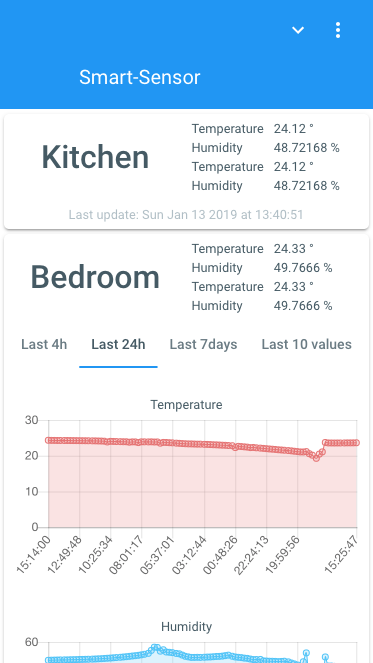

# Smart-Sensor

[](https://travis-ci.org/hunsalz/smart-sensor)
[](http://doge.mit-license.org)

## Watch [Smart-Sensor-App ↗](https://hunsalz.github.io/smart-sensor/) live.

Smart-Sensor consists of various sensor input sources and a central [Progressive Web App](https://en.wikipedia.org/wiki/Progressive_web_applications). Sensor values are collected via separate ESP8266 units. Smart-Sensor-App is build with [Polymer 3.0](https://polymer-library.polymer-project.org/3.0/docs/devguide/feature-overview). The App is easily extandable by new widgets and shows new sensor values instantly. As backend service [Parse](https://parseplatform.org/) is used.

## Impressions of Smart-Sensor-App



## Features

* Fulfills [Progressive Web Application characteristics](https://en.wikipedia.org/wiki/Progressive_web_applications#Characteristics)
* No cloud vendor lock-in with [Parse](https://parseplatform.org/)
* Possible to use in a local setup without cloud provider
* Low-price hardware

## Hardware listing

* (NodeMCU) ESP8266
* Examples for [Bosch environmental sensors](https://www.bosch-sensortec.com/bst/products/environmental/integrated_environmental_unit/overview_integratedenvironmentalunit)
* A bunch of wires

## Impressions of hardware assembling

TODO

## Setup Smart-Sensor-App

1. Install Polymer dependencies

```
npm install -g polymer-cli
```

2. Build PWA

*Note:* Change Parse settings in [./smart-sensor-app/src/smart-sensor-app/main-app.js](./smart-sensor-app/src/smart-sensor-app/main-app.js) accordingly.

```
cd Smart-Sensor/smart-sensor-app/
polymer install
```

3. Run PWA locally

```
polymer serve
```

Go to http://127.0.0.1:8081/components/smart-sensor-app/


4. Build for deployment

```
polymer build
```

## Setup ESP8266

*Precondition:* [Arduino IDE](https://github.com/arduino/Arduino) is installed.

*Dependency:* `git clone https://github.com/hunsalz/esp8266utils.git` into your `/arduino/libraries` directory.

1. Move [./config/config.h.template](./config/config.h.template) to `config.h` and fill out the blanks with your data.

2. Verify, compile and upload sketch to your ESP8266.

## Setup Parse Server

TODO